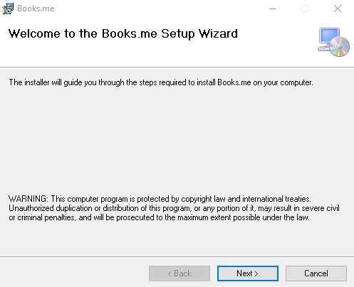
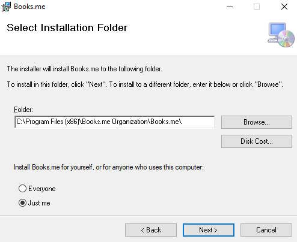
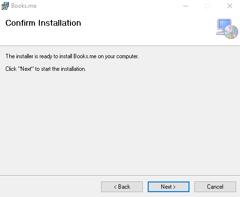
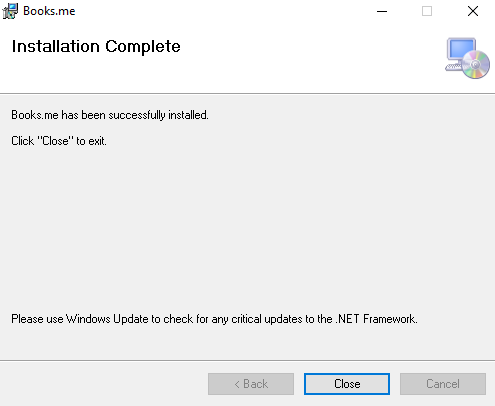

  ### Minimalistic Book Organizer and Reader
  
  ## Features

  * Secure Login / Register with AES Encryption
  * User-friendly UI
  * Convenient and straightforward functionality
  * Optimized for Low-End PCs
  
  
  ## Project Progress
- [x] Login/Register Form
  - [x] Complete UI
- [x] Implementing MVC pattern
- [x] Home Page
  - [x] Complete UI
- [x] Junction table
- [x] Library
  - [x] Different content
  - [x] Scroll function
  - [x] Book reader (PDF)
  - [x] Reading time
  - [x] Complete UI
 - [x] UNIT testing
- [x] Installation
- [x] Documentation
- [x] Presentation

## Installation

 The quickest way to get started with *Your **Books.Me** organizer* is to install our executable file from the [repo website](https://booksme.netlify.app/) as shown below:
##### Install the executable via the installation Wizard:
---

##### After you have finished installing the **Books.Me** organizer you should be met with the following screen.
---

## Docs

  * [Documentation](https://github.com/Books-me/Books.me/blob/master/Documentation/Documentation.pdf)
  * [Presentation](https://github.com/Books-me/Books.me/blob/master/Documentation/Books.me%20Presentation.pdf)

## Code Examples

  To view the examples, clone the Express repo and install the dependencies:

Sample code from our software:

> Login Button
----

> Current Book Data

## People

The current lead devs are [Ivan](https://github.com/ValWalker0304), [Damian](https://github.com/Azgorn) & [Bogdan](https://github.com/b0nk0)

We received positive reviews from lots of people : [Zakletiq Trezvenik](https://raw.githubusercontent.com/Books-me/Books.me/master/Images/Za%20tova%20books%20me.png)
Not actually reviewed yet!

## License

The Book Organizer and Reader (BooksMe) content management system is released under terms of the [License](LICENSE) 

